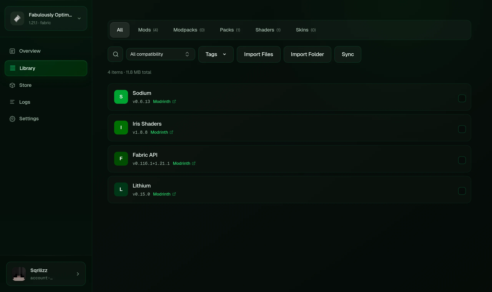
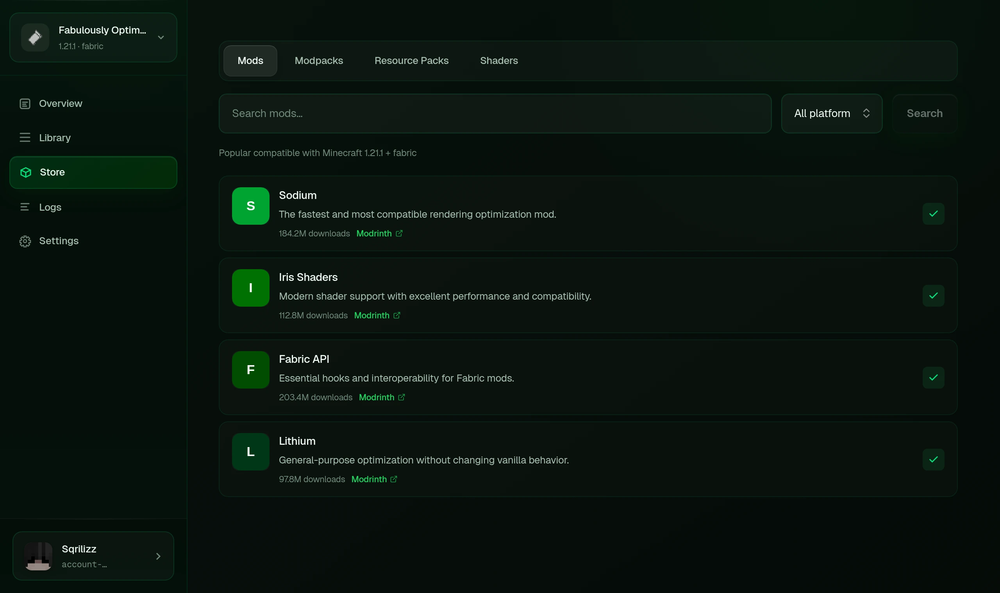
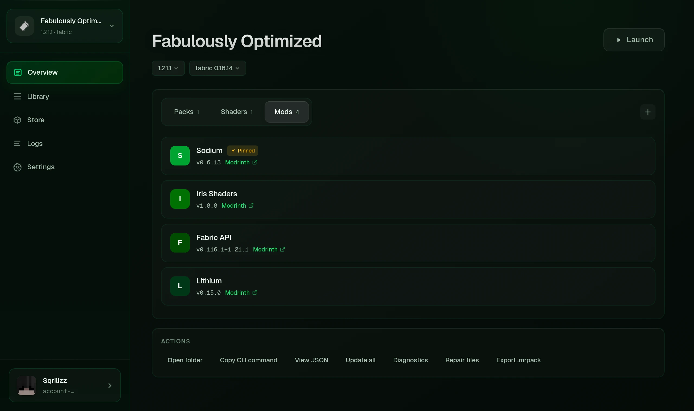
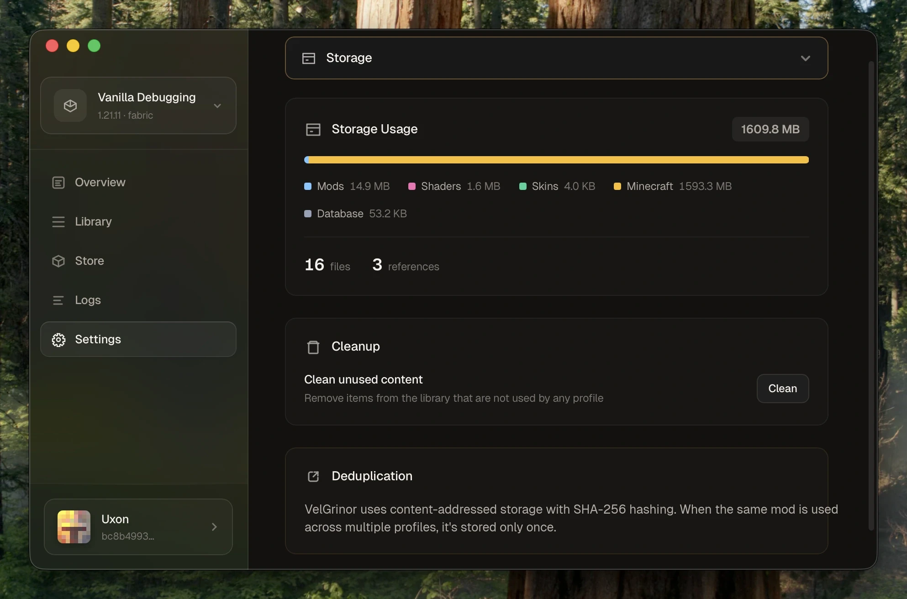

<p align="center">
  
</p>

<h1 align="center">VelGrinor</h1>

<p align="center">
  <strong>Быстрый и понятный Minecraft-лаунчер для обычных и модифицированных сборок.</strong><br>
  Microsoft- и офлайн-аккаунты, модпаки, общая библиотека файлов и наглядный прогресс запуска.
</p>

<p align="center">
  <a href="README.md">English</a> · <a href="README_RU.md">Русский</a>
</p>

<p align="center">
  <a href="https://github.com/Sqrilizz/VelGrinor/actions/workflows/ci.yml"></a>
  <a href="https://github.com/Sqrilizz/VelGrinor/releases"></a>
  <a href="LICENSE"></a>
  
</p>

<p align="center">
  
</p>

## Сделан для реальной игры

VelGrinor объединяет красивое приложение на Tauri и полноценный CLI на Rust. Профили хранятся в понятных манифестах, а одинаковые моды, ресурспаки и шейдеры не копируются для каждой сборки — лаунчер хранит их один раз по SHA-256.

| Играй | Собирай | Восстанавливай |
|---|---|---|
| Microsoft- и офлайн-аккаунты | Каталог Modrinth и CurseForge | Снимки профилей и откат |
| Fabric, Forge, NeoForge и Quilt | Импорт `.mrpack` и CurseForge ZIP | Анализ крашей и действия для исправления |
| Русский и английский интерфейс | Моды, шейдеры, ресурспаки и модпаки | Логи и диагностика подготовки игры |
| Discord Rich Presence | Настоящие иконки и ссылки на источники | Экспортируемые воспроизводимые профили |

### Прогресс, которому можно доверять

При скачивании и подготовке игры отображаются текущий этап, проценты, скорость и примерное оставшееся время, когда источник предоставляет достаточно данных. Установка большой сборки больше не выглядит как зависание лаунчера.

### Одна общая библиотека

Файлы адресуются по SHA-256. Если один мод нужен десяти профилям, VelGrinor хранит его один раз и создаёт чистые игровые инстансы из описаний профилей.

### Нативное приложение

Лаунчер поддерживает Windows, Linux и macOS, проверяет обновления, ищет подходящую Java, показывает скины, переключает язык и публикует статус в Discord. В Linux при запуске сохраняется графическое окружение, чтобы Java нормально использовала выбранную видеокарту и драйвер.

## Скриншоты

| Библиотека | Магазин |
|---|---|
|  |  |

| Содержимое профиля | Настройки |
|---|---|
|  |  |

## Установка

Готовые пакеты публикуются на странице [Releases](https://github.com/Sqrilizz/VelGrinor/releases):

- Windows: `.msi` или `.exe`
- Linux: `.AppImage` или `.deb`
- macOS: `.dmg`

### Сборка из исходников

Понадобятся актуальный стабильный Rust, Node.js 22 и системные зависимости Tauri для вашей платформы.

```bash
git clone https://github.com/Sqrilizz/VelGrinor.git
cd VelGrinor

# CLI
cargo build --release -p velgrinor

# Приложение
cd desktop
npm ci
npm run tauri:build
```

Готовые пакеты приложения появятся в `target/release/bundle/`.

## Быстрый старт

```bash
# Войдите через Microsoft или создайте офлайн-аккаунт
velgrinor account add
velgrinor account offline PlayerName

# Создайте и запустите профиль
velgrinor profile create performance --mc 1.21.4 --loader fabric
velgrinor mod add performance sodium
velgrinor launch performance
```

Полезные команды:

```bash
velgrinor library
velgrinor store search sodium
velgrinor modpack import ./pack.mrpack
velgrinor logs
velgrinor account list
velgrinor --help
```

## Внешние сервисы

Для входа через Microsoft нужен OAuth Client ID. Укажите его в **Настройки → Аккаунты** или через переменную `VELGRINOR_MS_CLIENT_ID`. Офлайн-аккаунты работают без авторизации Microsoft.

Для каталога CurseForge нужен API-ключ. Его можно добавить в настройках или передать через `VELGRINOR_CURSEFORGE_API_KEY`. Для Modrinth ключ не требуется.

Discord Rich Presence использует Application ID `1521208567036645426` и отключается в настройках.

## Разработка

```bash
cargo fmt --all -- --check
cargo clippy --workspace --all-targets -- -D warnings
cargo test --workspace

cd desktop
npm ci
npm run check
npm run build
```

Релизный workflow собирает пакеты для всех платформ через GitHub Actions. Pull request и воспроизводимые баг-репорты приветствуются.

## Ссылки

- [Релизы](https://github.com/Sqrilizz/VelGrinor/releases)
- [Сообщить о проблеме](https://github.com/Sqrilizz/VelGrinor/issues)
- [Discord](https://discord.gg/2ng6q3JNQ7)
- [Создатель — Sqrilizz](https://sqrilizz.tech)

## Лицензия

[MIT](LICENSE) © Sqrilizz
